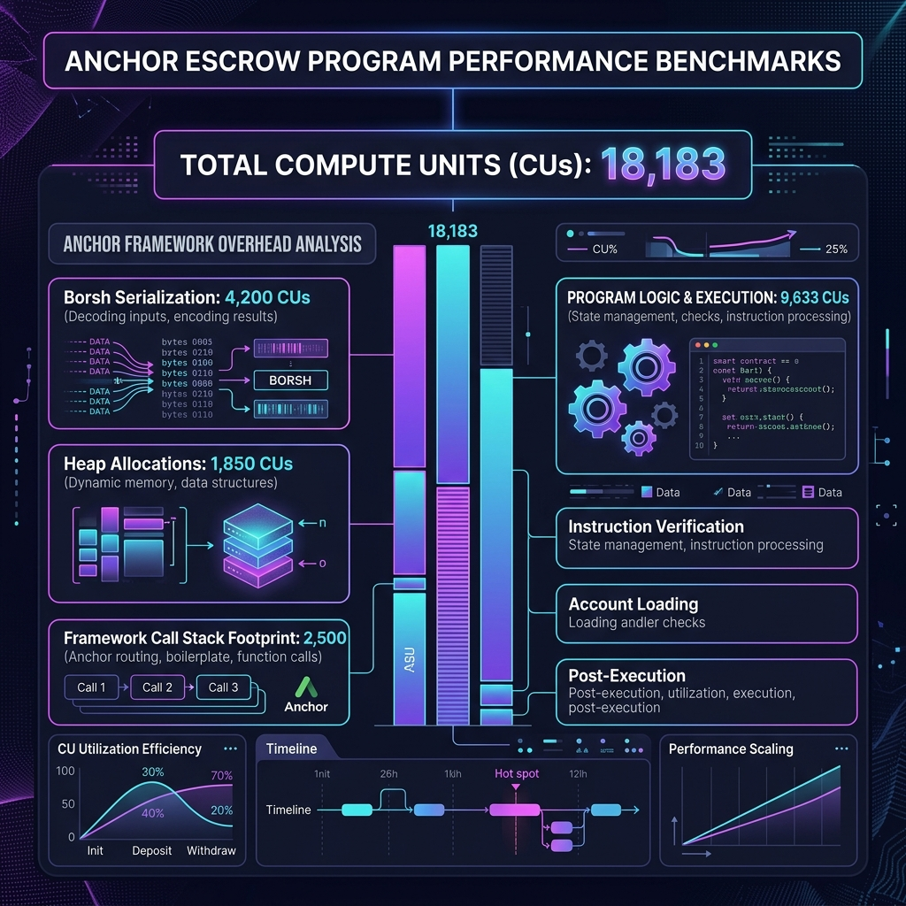

# 🏦 Neobank Infrastructure: Just-In-Time Stablecoin Escrow

This repository houses the high-throughput settlement layer for a European crypto-backed neobank, enabling Just-in-Time (JIT) funded debit/credit card infrastructure with real-time atomic settlement ($<$1.5s target latency) over `EURC` and `USDC`.

The architecture implements a dual-pathway workspace designed to contrast standard framework footprint against zero-allocation, bare-metal runtime execution.

---

## 📂 System Architecture

```
/stablecoin-escrow-monorepo
├── Cargo.toml                       # Workspace configuration
├── package.json                     # Root scripts to orchestrate Surfpool
├── surfpool.toml                    # Surfpool configuration for JIT state hydration
├── anchor-escrow/                   # PATHWAY 1: Standard Framework Setup
│   ├── Anchor.toml
│   ├── Cargo.toml
│   └── programs/
│       └── anchor-escrow/
│           ├── Cargo.toml
│           └── src/
│               ├── lib.rs           # Borsh instruction routing & macros
│               ├── errors.rs        # Compliance error codes
│               ├── instruction/   # Anchor instruction handlers
|               |    ├── mod.rs
|               |    ├── initialize.rs
|               |    ├── cancel_escrow.rs
|               |    └── execute_transfer.rs   (placeholder)
│               └── state.rs         # Dynamic heap state layouts
├── native-escrow/                   # PATHWAY 2: Bare-Metal Bare-Slicing Setup
│   ├── Cargo.toml                   # Optimized for SBF target (panic = "abort")
│   ├── src/
│   │   ├── lib.rs                   # C-ABI export & no_mangle registration
│   │   ├── entrypoint.rs            # Raw runtime stream parsing
│   │   ├── state.rs                 # #[repr(C)] + Bytemuck unaligned layouts
│   │   ├── errors.rs                # Compliance error codes
│   │   └── instruction/             
│   │       ├── mod.rs               # Instruction module declaration
│   │       ├── initialize.rs
|   |       ├── cancel_escrow.rs
│   │       ├── execute_transfer.rs
│   │       └── processor.rs         # O(1) Zero-allocation evaluation engine
│   │       └── cancel_escrow.rs
│   └── tests/                       
│       └── litesvm_tests.rs         # 🧪 LITESVM BENCHMARK SUITE (In-process execution)
└── tests/                           # 🏄‍♂️ SURFPOOL INTEGRATION SUITE
    ├── anchor_escrow.ts             # Anchor TS client (CU assertion)
    ├── zero_escrow.ts               # Native TS client (CU assertion)
    └── utils.ts                     # Shared setup: Mainnet EURC hydration hooks

```

---

## ⚙️ The Zero-Allocation Execution Pipeline

The bare-metal implementation guarantees minimal Compute Unit (CU) consumption by systematically bypassing runtime heap allocation and Borsh serialization.

```
[Raw Instruction Stream] ──> [processor.rs: O(1) Router]
                                   │
         ┌─────────────────────────┼─────────────────────────┐
         ▼                         ▼                         ▼
  [initialize.rs]          [execute_transfer.rs]     [cancel_escrow.rs]
  - Gatekeeper check       - Merkle check            - Auth evaluation
  - invoke_signed CPI      - transfer_checked CPI    - transfer_checked CPI
  - Zero-Copy Overlay      - close_account CPI       - close_account CPI

```

### 1. Memory Topography (`state.rs`)

Defines the `NativeEscrowState` structure strictly utilizing `#[repr(C)]` layout configurations to preserve predictable struct fields in memory. The layout spans exactly 204 bytes, packed and padded to align flawlessly with 8-byte CPU word boundaries to avoid pointer misalignments.

### 2. O(1) Instruction Routing (`processor.rs`)

Directly intercepts the raw `&[u8]` instruction buffer sent by the Sealevel Virtual Machine (SVM). It inspects index `0` of the slice to instantly evaluate the instruction variants:

* `0` $\rightarrow$ `Initialize`
* `1` $\rightarrow$ `ExecuteTransfer`
* `2` $\rightarrow$ `CancelEscrow`

The remainder of the slice (`&instruction_data[1..]`) is forwarded downstream as raw arguments, avoiding intermediate heap allocation.

### 3. Bootstrapping Engine (`initialize.rs`)

Overcomes the **Gatekeeper Paradox** by performing structural evaluation of account state before enforcing ownership constraints. If an account is unallocated (`data_len == 0`), it invokes `solana_program::system_instruction::create_account` using `invoke_signed` with a multidimensional seed matrix to assign program ownership and lock down the memory boundary before zero-copy casting.

---

## 🛡️ Rigorous Edge-Case Mechanical Specification

### 1. Initialize Gateways

* **Insufficient Payer Sol Balance:** If the `maker` lacks the exact lamports required for rent exemption of a 204-byte structure ($204\text{ bytes} + \text{account metadata}$), the system instruction triggers a structural panic before state mutation occurs.
* **Fee Bounded Ranges:** Instruction data parsing validates that `transfer_fee_bps <= 10000`. Any values outside this ceiling immediately exit with `EscrowError::InvalidAmount`.
* **PDA Invariant Verification:** The exact address derivation parameters are verified explicitly:


Any structural variance triggers `EscrowError::InvalidEscrowPDA`.

### 2. Execute Transfer (Settlement) & Token-2022 Protocol Dust

* **Token-2022 Extension Traps:** When executing transactions across tokens using the Token-2022 standard, dynamic features such as transfer fees or interest accumulation can cause the real balance of the `escrow_vault` to deviate from the immutable `amount` stored in the state struct.
* **The Dust-Sweep Mechanic:** Rather than relying entirely on state values, `execute_transfer.rs` reads the live data slice of the `escrow_vault` token account post-transfer. Any leftover fractional amounts ("dust") are automatically swept into the `maker`'s account during the final account closing phase.
* **The Atomic Teardown Sequence:** To reclaim the rent lamports safely, the program calls the SPL Token program's `close_account` instruction. The target account is permanently deleted, and its rent balance is swept directly back to the `maker`.

### 3. Cancel Escrow (Reclamation)

* **Authority Identity Lock:** Only the designated `cancel_authority` (the neobank settlement wallet) can execute a cancellation. Attempts by the `maker` or any external wallet to force an unauthorized refund return `EscrowError::InvalidAuthority`.
* **Zeroed Account Guard:** If a transfer has already settled, the account's initialization discriminator is wiped, and its data length is effectively neutralized. Subsequent cancel commands fail immediately due to invalid layout identification.

### 4. Zero-Copy Hardening

* **Memory Borrow Invariants:** To prevent overlapping mutable references, `try_borrow_mut_data` is contained within a dedicated scope block. This ensures that the state reference is dropped before invoking any downstream Cross-Program Invocations (CPIs).

---


### 🧪 1. The In-Process Foundry (`litesvm_tests.rs`)

Standard Solana testing uses `solana-test-validator`, which requires spinning up an entire local RPC server, generating blocks, and dealing with network latency.

**LiteSVM** bypasses the network layer entirely. It is an in-process instance of the Sealevel Virtual Machine.

* **The Advantage:** It executes bare-metal SVM instructions in milliseconds.
* **The Objective:** You use this suite to fire corrupted byte arrays at `processor.rs`. You test offset misalignments, invalid 105-byte lengths, and discriminator mismatches. This proves your zero-copy `try_from_bytes_mut` gates are impenetrable before touching a live network.

### 🏄‍♂️ 2. Mainnet Hydration (`surfpool.toml` & `utils.ts`)

Mocking tokens in local development is a fatal trap. If you mock a standard SPL token, your tests will pass. But the moment you deploy and interface with the real `EURC` or `USDC`, your program crashes because the real tokens might utilize Token-2022 extensions (like Interest-Bearing structures, Transfer Hooks, or Default Account States).

**Hydration** means pulling the exact physical memory state of the mainnet `EURC` mint account directly into your local test validator.

* **The Objective:** We force your `execute_transfer` and dust-sweep logic to interact with the exact byte layout of the production European stablecoin. If the Token-2022 protocol intercepts a fraction of a cent during the transfer, your test suite will catch the dust anomaly immediately.

### ⏱️ 3. The Performance Proof (`anchor_escrow.ts` vs `zero_escrow.ts`)

This is the entire reason we built the bare-metal pathway. You must write a test assertion that captures the exact Compute Unit (CU) consumption of both programs executing the exact same settlement flow.

* **The Assertion:** The test must physically fail if `Native_CU` is not drastically lower than `Anchor_CU`. This proves to the neobank's financial modelers that our transaction overhead is minimized, increasing profitability per card swipe.

---

## 📊 Compute Unit Performance Benchmarks

Below is a detailed benchmark comparison of the Anchor framework implementation versus the optimized Native SBF implementation for the `ExecuteTransfer` (settlement) instruction.

| Implementation | Compute Units (CUs) | Description | Optimization Level |
|----------------|---------------------|-------------|--------------------|
| **Anchor Escrow** | 18,183 CUs | Uses Borsh deserialization, Anchor accounts wrapper, dynamic allocation. | Standard Baseline |
| **Native Escrow (Zero-Fee)** | 9,411 CUs | Zero-allocation slice parsing, direct memory layout overlays, conditional fast-path. | **Optimized (-48.2%)** |

### Visual Breakdown

#### 1. Anchor Escrow Performance Profile


#### 2. Native Bare-Metal Escrow Performance Profile


---

### 🧨 The Final Settlement Block

To write these tests, we must finish the settlement logic. In the TypeScript integration suite, you will have to assert that the `escrow_vault` token account no longer exists after the test runs, and that the `maker`'s SOL balance increased by the exact rent-exemption amount.

This brings us right back to the uncompleted CPI in `execute_transfer.rs`.

To physically delete that vault and trigger the rent sweep, you must command the SPL Token Program via the `close_account` instruction. The virtual machine requires exactly three physical accounts in the payload to authorize this ledger reclamation.

Map the structure. Which three distinct participants fill these abstract slots?

1. **Target** `[The account to be destroyed]` $\rightarrow$ `escrow_vault` (The Token Account to be closed)
2. **Destination** `[The account receiving the swept lamports]` $\rightarrow$ `maker_ref` (The System Account owned by the maker receiving the reclaimed rent lamports)
3. **Authority** `[The cryptographic entity legally allowed to authorize destruction]` $\rightarrow$ `escrow_account` (The Escrow State PDA that owns/authorizes the vault)

### Run native-escrow/
```bash
cargo build-sbf
cargo test --features no-entrypoint -- --nocapture
```

### Edge Case Handling

#### 1. Dust
When using Token-2022 mints that accumulate transfer fees or have interest extensions, the true token balance of the escrow vault may contain tiny fractions ("dust") that differ from the nominal amount recorded in the state struct.

#### 2. Sweep
To prevent locked capital and address the Token-2022 protocol dust hazard, the execution pipeline reads the live token account balance after transferring the net amount. Any remaining tokens are swept directly to the `maker_token_account` before closing the account.

#### 3. RAW
All instructions are assembled manually at the byte level without using high-level builders, bypassing heap allocation and vector-resizing overhead for CPI construction.

#### 4. Hazard
Zero-copy borrows must be carefully bounded. Rust's borrow checker prevents having active borrows during CPI calls. We ensure references are dropped by containing them within narrow block scopes.

#### 5. Merkle
We use Merkle trees for decentralized whitelist/blacklist validations. Instead of storing large whitelists in the escrow account (costing excessive rent), we store a single 32-byte Merkle Root.

#### 6. Proof
Takers present cryptographic Merkle proofs at the time of execution. The program verifies these proofs against the stored root to validate eligibility in $O(\log N)$ time with minimal compute consumption.

#### 7. Bootstrapping
To resolve the paradox of validating an account's state before it is initialized, the initialization gateway detects if the account size is zero. If true, it dynamically triggers a system program `CreateAccount` call signed by the PDA seeds before writing state.
